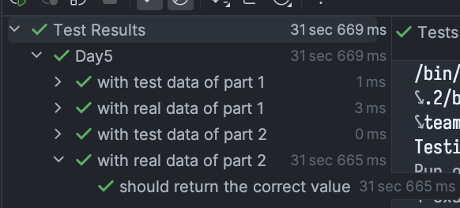

# advent_of_code_2023
My take on Advent of code 2023. This year in Ruby, to prepare for the future 😉

## Day 1

Relatively easy, the second part was ambiguous AF and the problem wasnt well specified.

## Day 2

Today the algo was clear, I just struggled a bit with ruby's many collection methods but a healthy dose of Jetbrains AI Assistant helped me a lot.

Ruby plays out like a functional language in some situations, even if it's not. It's fine, but Scala is probably better for this mixed style.

## Day 3

God I hade 2d grids

## Day 4

In general an easy day, nothing much to say

## Day 5

Interesting problem! I liked working with ranges, made everything easier.

What I didnt like:

I'm not programming particularly performance oriented, but 32 secs for ~14 millions method calls? 

Either

* I'm missing something
* Ruby is horrendously slow

I'm leaning towards reimplementing this in scala/go/python (maintaining the domain modeling which I liked) to have a comparison.

## Day 6

Part 1 very easy: .count() is nice.